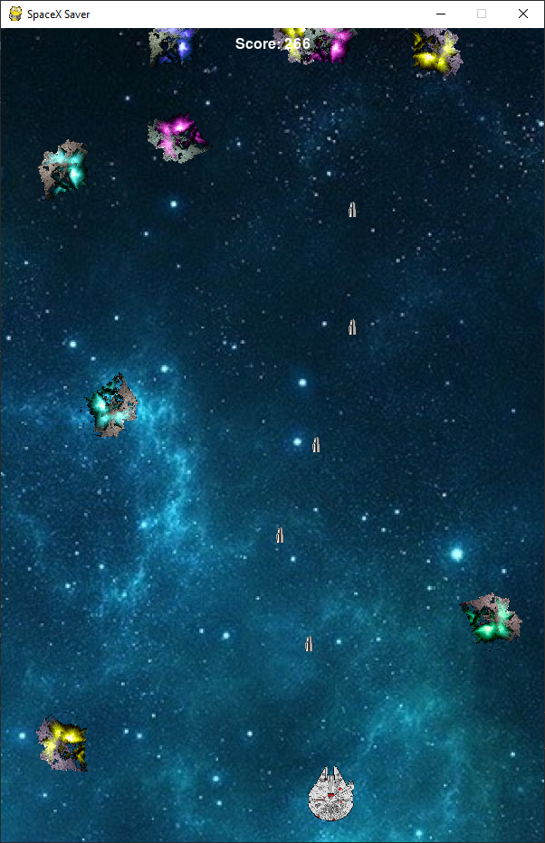
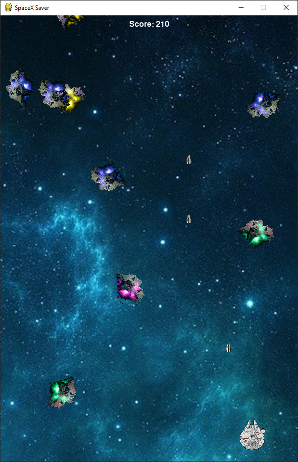

# Space X Saver
#### About Project
A lightweight and Addictive space shooter game with beautiful UI and easy controls, based on the python's Pygame Library, ideal for passing time
***
**FEATURES**

 - Addictive
 - Lightweight
 - Runs purely on Python
 - Easy controls
 -  Runs on any system with Python and Pygame Library

***
#### Developed by: [**Agnellus Fernandes**](https://www.linkedin.com/in/agnellus-fernandes-81232b192)
***

### Screenshots!

***
**Tools used**  

 - Pycharm
 - Python 3
 - Pygame Library
